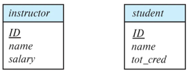
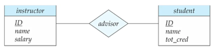
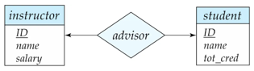
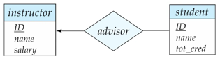
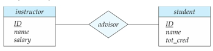

# Chapter01 keyword

### 키

데이터베이스에서 특정 레코드를 다른 레코드와 구분하기 위해 사용하는 Attribute(속성)을 의미합니다.  
여러 종류가 존재합니다.
- Super Key : 레코드를 유일하게 식별할 수 있는(유일성) 모든 필드의 조합, 키
- Candidate Key : 유일성을 만족함과 동시에 column의 개수가 최소인(최소성) 조합, 키
- Primary Key : 특정 테이블의 대표 식별자로 지정된 키, 한 테이블에는 오직 하나만 존재합니다.
- Alternate Key : 여러 Candidate Key들 중에서 Primary Key로 선정되지 않은 나머지 키를 의미합니다.
- Foreign Key : 다른 테이블의 Primary Key 혹은 Candidate Key를 참조하는 키를 의미합니다.

  

### 외래키 (Foreign Key)
특정 테이블에서 다른 테이블의 Primary Key 혹은 Candidate Key를 Column에 가지고 있는 것을 말합니다.  
다른 테이블에 존재하는 정보가 필요할 때, 만약 단순히 해당 데이터를 현재 테이블에 column을 추가하는 식으로 구현한다면,
중복된 데이터를 여러 곳에 저장하게 되어 데이터 Inconsistency 문제, 공간의 낭비가 발생할 수 있습니다.
따라서 다른 테이블에 존재하는 정보의 Key 하나만 현재 테이블에 추가하고 필요할 때 마다 join을 통해 정보를 가져오는 방식을 사용합니다.
이를 통해 데이터의 중복을 줄일 수 있습니다. 이때 사용하는 다른 테이블의 Key를 현재 테이블의 Foreign Key 라고 부릅니다.  
추가적으로 MySQL의 InnoDB 엔진의 경우에는 Foreign Key Constraint를 통해 데이터의 무결성을 보장합니다.

  

### 기본키(Primary Key)
테이블의 각 레코드들을 유일하게 식별하기 위한 Column 혹은 Column의 조합을 의미합니다.
테이블에서 중복되지 않은 Unique한 값을 가져야하고, Null 값을 가질 수 없습니다.

  

### E-R 다이어그램
각 엔티티와 엔티티의 관계를 시각적으로 표현한 다이어그램입니다.
- 구성요소
    - 엔티티(Entity) : 데이터베이스에 표현하고자 하는 대상을 의미합니다. (테이블 명)
        - 예) 학생, 교수, 강의 등  
            
    - 속성(Attribute) : 엔티티가 가지고 있는 속성을 의미합니다. (테이블에 속한 Column)
        - 예) 학생의 속성으로 학번, 이름, 학과 등
    - 관계(Relationship) : 두 개 이상의 엔티티 사이의 관계를 의미합니다. (두 테이블 사이의 관계)
        - 예) 학생은 여러 강의를 수강할 수 있고, 강의는 여러 학생을 수용할 수 있습니다.  
            

  

### 복합키(Composite Key)
 두 개 이상의 column을 조합하여 각 레코드를 유일하게 식별할 수 있는 키를 의미합니다.
복합키는 각 column이 개별적으로는 유일성을 만족하지 않지만, 두 column을 조합하면 유일성을 만족합니다.  
복합키를 사용하는 경우에 개별적인 컬럼 하나에 인덱스를 거는 경우 제대로된 활용을 하기 힘들어 복합 인덱스를 생성하는 경우가 많습니다. 
다만, 이는 인덱스의 복잡성을 증가시키고 데이터 조작시 성능적으로 문제가 생길 수 있어 가능한 필요한 컬럼 수를 최소화해서 키를 구성하는 것이 좋습니다.

  

### 연관관계
위에서의 Foreign Key와 이어지는 내용으로 테이블 간의 관계를 의미합니다. 주로 join을 통해 실현되고 다음과 같은 종류가 있습니다.
- 일대일(One-to-One) : 한 테이블의 레코드가 다른 테이블의 한 개의 레코드와만 연결됩니다.  
    
  - 한명의 지도교수가 한명의 학생에게만 매핑
- 일대다(One-to-Many) : 한 테이블의 레코드가 다른 테이블의 여러 레코드와 연결됩니다.  
    
  - 한명의 지도교수가 여러명의 학생에게 매핑
- 다대다(Many-to-Many) : 한 테이블의 한 레코드가 다른 테이블의 여러 레코드와 연결될 수 있고 동시에 반대쪽에서도 한 레코드가 여러 레코드와 연결될 수 있습니다.  
    
  - 다수의 교수가 다수의 학생에게 매핑
  

### 정규화 (Normalization)
DB 테이블 설계시 중복을 최소화하고 데이터 무결성을 보장하기 위해 테이블을 구조화하는 과정을 의미합니다.  
각 정규화를 진행한 테이블을 정규형이라고 부릅니다. 많은 정규형, 정규화가 존재하지만 일반적으로 1NF, 2NF, 3NF 정규화를 주로 사용합니다. 

- 1NF(First Normal Form, 제1정규형) : 테이블의 모든 속성이 **원자값(Atomic Value)** 을 가지도록 테이블을 구조화하는 것을 의미합니다.   
    쉽게 말해 한 칸에 하나 이상의 값이 들어갈 수 없도록 설계한 테이블이 1NF입니다. 
- 2NF(Second Normal Form, 제2정규형) : 1NF를 만족하면서 **부분 함수 종속을 제거**하는 것을 의미합니다.  
  Composite Key의 일부 Column에 의해 다른 Column이 결정되는 경우 2NF에 위반됩니다.
- 3NF(Third Normal Form, 제3정규형) : 2NF를 만족하면서 **이행적 종속** 이 없어야합니다.  
  2NF와 맥락이 비슷하게, 기본키가 아닌 이외의 다른 Column에 의해 결정되는 다른 Column이 존재하면 3NF에 위반됩니다.

  

### 반정규화
정규화된 테이블을 특정 상황에 따라 의도적으로 더 낮은 단계의 정규형의 형태로 돌아가는 과정을 의미합니다.  
가장 일반적인 상황으로 정규화를 진행할수록 Join 연산을 많이 해야 원하는 데이터를 가져오게 되는데, 해당 Join 연산이 성능에 많은 영향을 미칠경우 반정규화를 진행합니다.
뿐만 아니라, 테이블의 크기가 작아서 Join 연산을 할 필요가 없거나, 테이블 간의 관계가 복잡하여 Join 연산을 할 수 없는 경우에도 반정규화를 진행합니다.