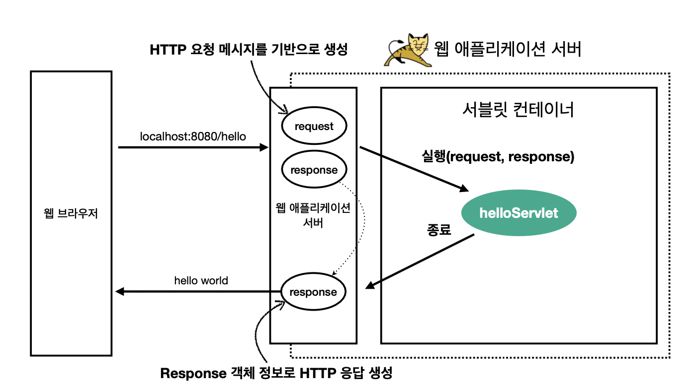
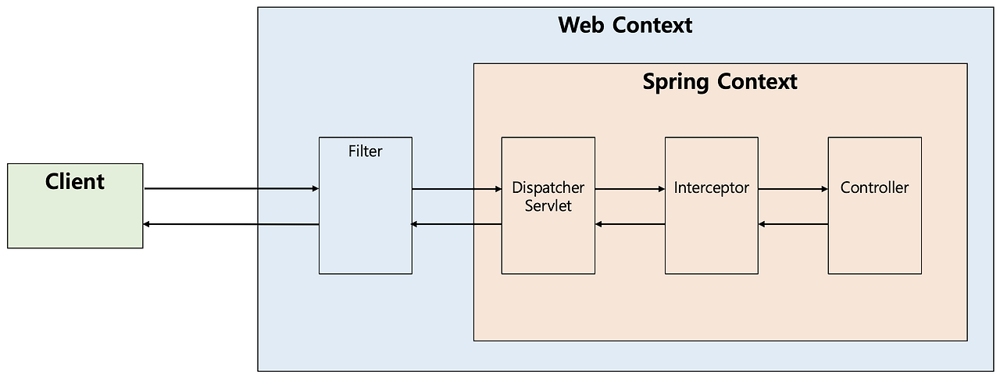

# chapter 04

### DI(Dependency Injection)
의존성 주입

스프링 프레임워크에서 지원하는 3가지 핵심 프로그래밍 모델 중 하나.  
객체가 의존하는 다른 객체를 현재 객체에서 직접 생성하지 않고 외부에서 생성된 객체를 주입받는 프로그래밍 패턴이다.

장점
1. 의존성이 줄어든다.
    - 의존한다는 것은 그 의존대상의 변화에 취약하다는 것. (대상이 변화하였을 때, 이에 맞게 수정해야함) 
      하지만, DI로 구현하게 되었을 때, 주입받는 대상이 변하더라도 그 구현 자체를 수정할 일이 없거나 줄어들게된다.
2. 코드 재사용성이 높아진다.

3. 테스트가 용이해진다.

4. 가독성이 높아진다.

세가지 방법
1. 필드 주입
   ```java
   @Component
   public class SampleController {
      @Autowired
      private SampleService sampleService;
   }
   ```
   좋은방법은 아니다. 
   - 코드 실행전까지 순환참조의 문제를 알 수 없다.  
     - 필드 주입 방식은 스프링 컨테이너에 Bean 생성되고 초기화 된 이후에 의존성 주입이 이루어지기 때문.
   - 불변성 보장이 안된다.
     - 필드 주입 방식은 final 키워드를 사용할 수 없다. 따라서 의존성이 변경될 가능성이 있다.
   

2. 수정자 주입
   ```java 
   @Component
   public class SampleController {
       private SampleService sampleService;
   
       @Autowired
       public void setSampleService(SampleService sampleService) {
           this.sampleService = sampleService;
       }
   }
   ```
   set method를 정의해서 주입받는 방식이다.
   Setter Injection으로 의존관계 주입은 런타임시에 할 수 있도록 낮은 결합도를 가지게 구현된다.  
   
   하지만, Setter Injection을 통해서 Service의 구현체를 주입해주지 않아도 Controller 객체는 생성이 가능하다. 이 때, Controller 객체가 생성가능하다는 것은 내부에 있는 Service의 method 호출이 가능하다는 것인데,
   set을 통해 Service의 구현체를 주입해주지 않았으므로, NullPointerException 이 발생한다.


3. 생성자 주입
   ```java
   @Component
   public class SampleService {
   private SampleDAO sampleDAO;
   
       @Autowired
       public SampleService(SampleDAO sampleDAO) {
           this.sampleDAO = sampleDAO;
       }
   }
   
   @Component
   public class SampleController {
       private final SampleService sampleService = new SampleService(new SampleDAO());
       ...
   }
   ```
   생성자를 사용하는 방법이 좋은 이유는 필수적으로 사용해야하는 의존성 없이는 Instance를 만들지 못하도록 강제할 수 있기 때문이다.
   
   - null을 주입하지 않는 한 NullPointerException 은 발생하지 않는다.   
     - 의존관계 주입을 하지 않은 경우에는 Controller 객체를 생성할 수 없다. 즉, 의존관계에 대한 내용을 외부로 노출시킴으로써 컴파일 타임에 오류를 잡아낼 수 있다.

   - final 을 사용할 수 있다.
     - final 키워드를 사용하여 불변성을 보장할 수 있다. 즉, 의존관계가 변경될 일이 없다.

   - 순환 의존성을 알 수 있다.
     - 앞서 살펴 본 Field Injection에서는 컴파일 단계에서 순환 의존성을 검출할 방법이 없지만, Construtor Injection에서는 컴파일 단계에서 순환 의존성을 잡아 낼 수 있다.

### IoC(Inversion of Control)
제어의 역전
 
IoC는 객체의 생성과 생명주기를 개발자가 아닌 IoC 컨테이너가 관리하는 것을 의미한다.  
IoC 컨테이너는 객체를 생성하고, 의존관계를 주입하고, 객체의 생명주기를 관리하는 역할을 한다.

### 프레임워크와 API의 차이

- 프레임워크 : 뼈대나 기본구조의 뜻으로, 개발환경에서 필요한 여러 클래와 인터페이스, 컴포넌트들의 집합을 의미한다.

- API : 특정 소프트웨어에서 다른 소프트웨어와 통신하기 위해 제공하는 인터페이스를 말한다.

### AOP (Aspect Oriented Programming)
관점 지향 프로그래밍

AOP는 로깅, 트랜잭션, 캐싱 등 핵심 비즈니스 로직에서 벗어난 별개의 횡단 관심사를 모듈화하는 프로그래밍 기법을 의미한다.

핵심 비즈니스 로직에서 벗어나는 부가적인 기능들을 모듈화 함으로써 관심사를 분리시킨다. 이를 통해 코드의 중복을 줄이고 유지보수성을 향상시킬 수 있다.


### 서블릿(Servlet)
클라이언트의 요청을 처리하고 그 결과를 반환하는 기술


스프링에 API 요청이 들어오면, 먼저 디스패쳐 서블릿이 이를 받아 요청 URL과 HTTP 메서드를 기준으로 해당 요청을 처리할 컨트롤러 메서드를 핸들러 맵핑을 통해 찾는다.
이후 핸들러 어댑터가 해당 메서드를 호출해서 요청을 처리하고 받은 응답을 다시 디스패쳐 서블릿에 전달헌다.
