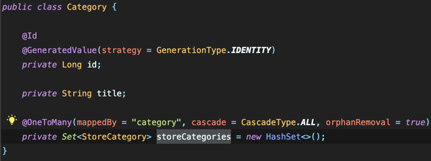

## Domain

사전적 의미는 영토, 영역

개발적으로는 두가지 의미로 쓰인다.

- Business Domain
    - 소프트웨어가 해결하고자 하는 “현실세계의 문제영역”

      병원시스템을 만든다면 도메인은 “환자”, “의사”, “진료 기록”, “예약” 등일 것

- 소프트웨어 아키텍쳐의 Domain 계층
    - 위의 Business Domain을 코드로 표현한 부분

### DDD

Domain Driven Design 도메인 중심 설계

말 그대로 “도메인”을 중심에 두고 설계하는 방식

소프트웨어 개발 방법론 중 하나.

처음 백엔드 개발자가 가장 많이 사용하는 방식은 계층형 Architecture
- (Controller, Service, Domain, Repository)

Domain?

- Domain Layer

- 문제의 영역을 의미, 해결하고자 하는 문제와 관련되어있는 모든 코드들이 모여있는 순수한 영역

4가지의 계층으로 구성됨
- Presentation - Application - Domain - Infrastructure

각 계층을 건너 띄워선 안되고, 서로의 영역을 침범해서는 안되는 것이 원칙

- Presentation → Controller, DTO, …

- Application → Application Service, DTO ↔ Domain Mapper, …

- Domain → Domain Model, Domain Repository, Domain Service, …

- Infrastructure → Config, Persistence, Security, Util, ….

모든 것은 Domain 으로부터 나온다. Client가 사용할 수 있도록, 데이터를 저장하기 위해 부가기능을 다른 레이어에 추가함으로써 서버의 크기가 커진다.

Domain Layer는 순수한 Java 코드만으로 이루어져야하는 것이 원칙.

왜? Framework의 기술은 버전이 바뀔수록 크게 바뀌고, Deprecated 되는 것이 많다. 외부의 다른 기술에 의존하게 될 경우 핵심 비즈니스 로직 자체가 바뀌는 경우가 있음. 이는 유지보수 비용으로 치환된다.)

하지만, 이런 세세한 원칙을 전부 지키면서 코딩을 하기에는 피로도, 코드량 증가, JPA 와 같은 ORM의 편한 기능 (Dirty Check , Lazy Loading)을 사용하지 못하는 안좋은 점이 존재한다.

어떤 소프트웨어 방법론을 사용하더라도 유동적으로, 융통성있게 사용하는 것이 중요 포인트

## 양방향 매핑

두 엔티티가 서로의 관계를 알고있는 매핑방식 ⇒ “A가 B를 알고, B도 A를 안다”

User ↔ Category, Store ↔ Category 에 대해서 생각해보자.

1. User ↔ Category
    - 특정 유저가 카테고리를 선택하게된다. 즉, 특정 유저는 자신이 어떤 카테고리를 선택했는지 알 수 있어야한다. → User는 Category를 알고 있음
    - 하지만, Category를 통해서 어떤 유저가 해당 카테고리를 선택했는지에 대한 내용이 굳이 필요할까?

      관리자 서버가 해당 서버에 합쳐진 형태가 아니라면 굳이 필요하진 않을 사항이다.

    - 이 경우 Category는 User를 모르기 때문에 단방향 매핑이 된다.
2. Store ↔ Category
    - 먼저, 가게가 어떤 카테고리의 가게인지 알아야 한다. 가게 자체도 본인이 카테고리를 선택할 것.
    - 추가적으로 카테고리를 통해 해당 카테고리에 어떤 가게가 있어야하는지도 알아야 한다.
    - 따라서 Store 도 Category를 알고, Category도 Store를 알기 때문에 양방향 맵핑이 된다.


이와같은 이유로 Category Entity의 OneToMany 관계를 Store는 있지만 User는 만들지 않음.

## N+1 문제
한개의 쿼리를 날렸는데, 연관된 데이터를 가져오기 위해 N개의 추가 쿼리가 날아가는 상황 ⇒ N+1 개 쿼리 발생

예시, 
주문목록과 해당 주문목록에 대한 상품정보를 가져오는 쿼리
```java
List<Order> orders = orderRepository.findAll();
for (Order order : orders) {
    List<Product> products = order.getProducts();
}
```

먼저, 주문 목록을 전부 가져온 다음, 각각의 주문에 대한 상품을 조회할 때, 
주문목록을 가져오는 쿼리 1회, 각 주문에 대해 상품정보를 가져오는 쿼리 N회 이렇게 N+1 개의 쿼리가 발생한다.

해결방법은 Fetch Join을 사용하거나 Batch Size를 설정하는 방법이 있다.
1. Fetch Join vs 일반 Join
    - JPQL을 이용하여 일반 Join을 해서 데이터를 가져올 경우, 쿼리 자체는 Join을 해서 가져오긴 하지만,
      연관된 엔티티를 가져오는 것이 아니라, 단순히 조회만 하게 된다.
      즉, join 대상에 대한 영속성에 관여하지 않는다.
    - Fetch Join을 사용하면 연관된 엔티티의 컬럼들도 모두 SELECT 한다.

2. Batch Size
    - Batch Size를 설정하면, N개의 쿼리를 날리는 것이 아니라, 한번에 N개씩 가져오게 된다.
    - 예를 들어, Batch Size를 10으로 설정하면, 1~10까지의 쿼리를 날리고, 11~20까지의 쿼리를 날리게 된다.
    - 이 경우에도 N+1 개의 쿼리가 발생하지만, 한번에 10개씩 가져오기 때문에 성능이 개선된다.